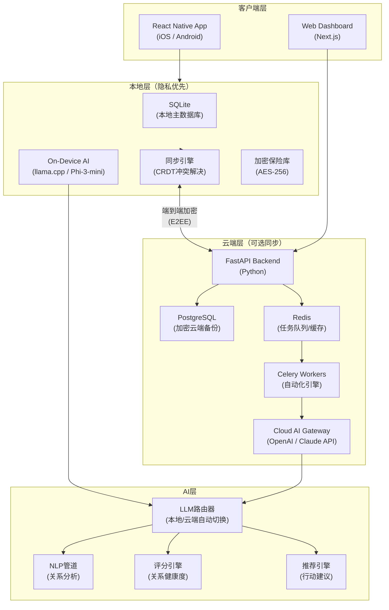
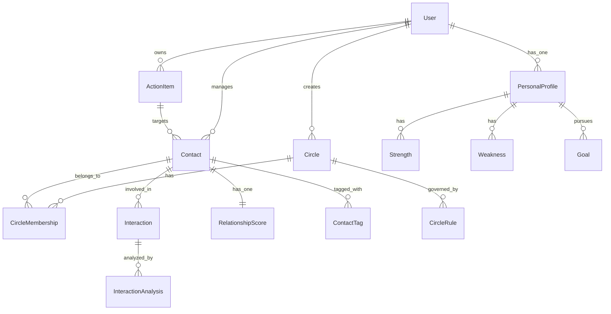
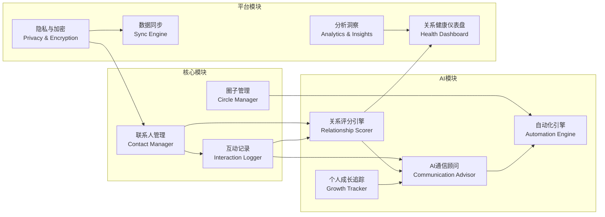
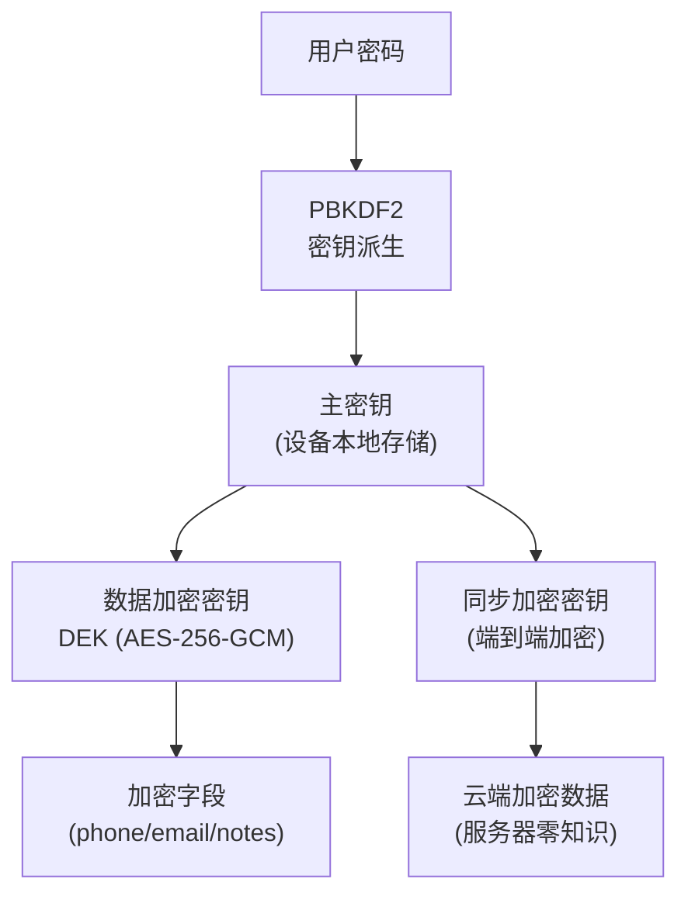
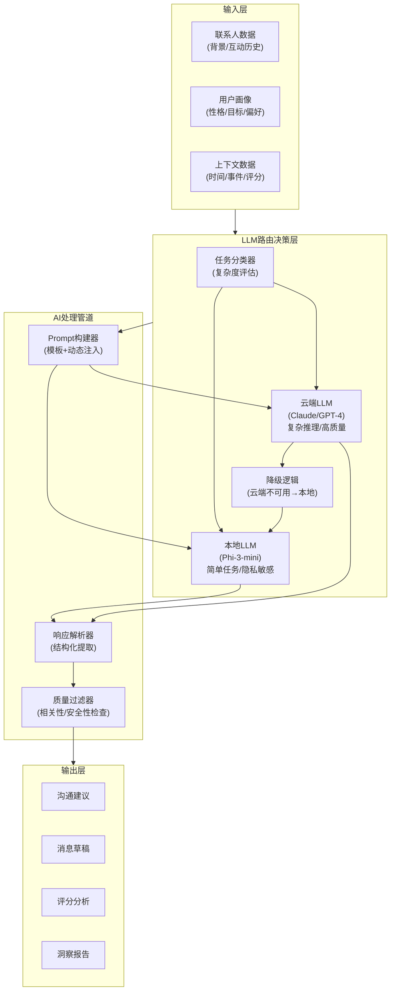
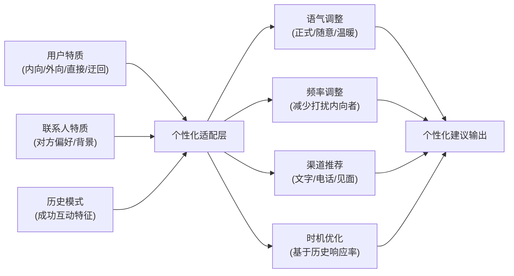
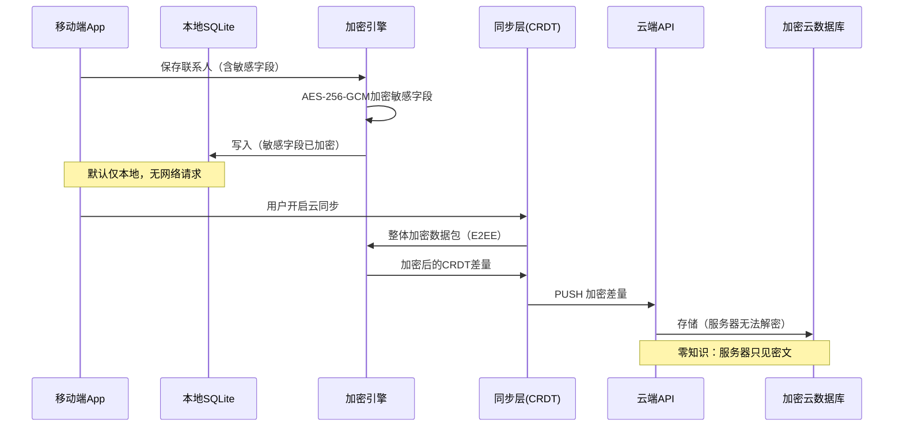

# 个人资源管理应用（PRM）技术架构设计文档

---

## 一、系统概述

**产品定位**：Personal Resource Management（PRM）——个人关系网络与资源管理系统

**核心价值**：
- 结构化管理个人社交圈层
- AI驱动的关系维护建议
- 隐私优先的本地化数据存储
- 量化关系健康度，自动化维护动作

---

## 二、系统架构

### 2.1 整体架构图



### 2.2 技术栈选型

| 层级 | 技术选型 | 选择理由 |
|------|----------|----------|
| 移动端 | React Native + Expo | 跨平台，JS生态，快速迭代 |
| Web端 | Next.js 14 (App Router) | SSR/SSG，SEO，与RN共享逻辑 |
| 本地数据库 | SQLite (via Expo SQLite) | 离线优先，零配置，隐私保障 |
| 云端数据库 | PostgreSQL + pgvector | 向量搜索支持AI语义查询 |
| 后端框架 | FastAPI (Python) | 异步高性能，AI生态最佳 |
| 任务队列 | Celery + Redis | 定时任务，自动化提醒 |
| 本地AI | Phi-3-mini / llama.cpp | 设备端推理，隐私保护 |
| 云端AI | Claude API / OpenAI | 复杂推理，高质量建议 |
| 同步协议 | CRDT (Yjs) | 无冲突离线同步 |
| 加密 | AES-256-GCM + E2EE | 端到端加密，零知识架构 |
| 状态管理 | Zustand + React Query | 轻量，服务端状态分离 |
| 共享逻辑 | tRPC / Zod | 端到端类型安全 |

---

## 三、数据模型设计

### 3.1 ER图



### 3.2 核心数据表定义

#### `users` — 用户主表

```sql
CREATE TABLE users (
    id              UUID PRIMARY KEY DEFAULT gen_random_uuid(),
    email           TEXT UNIQUE,
    display_name    TEXT NOT NULL,
    timezone        TEXT DEFAULT 'Asia/Shanghai',
    locale          TEXT DEFAULT 'zh-CN',
    encryption_key_hash TEXT,           -- 用于验证本地加密密钥
    sync_enabled    BOOLEAN DEFAULT FALSE,
    created_at      TIMESTAMPTZ DEFAULT NOW(),
    updated_at      TIMESTAMPTZ DEFAULT NOW()
);
```

#### `contacts` — 联系人表

```sql
CREATE TABLE contacts (
    id              UUID PRIMARY KEY DEFAULT gen_random_uuid(),
    user_id         UUID REFERENCES users(id) ON DELETE CASCADE,
    
    -- 基本信息
    name            TEXT NOT NULL,
    nickname        TEXT,
    avatar_url      TEXT,
    birth_date      DATE,
    
    -- 联系方式（加密存储）
    phone_encrypted TEXT,               -- AES-256加密
    email_encrypted TEXT,
    wechat_id_encrypted TEXT,
    social_links    JSONB DEFAULT '{}', -- {"linkedin":"...","weibo":"..."}
    
    -- 关系属性
    relationship_type TEXT NOT NULL,    -- 'colleague','friend','family','mentor','client','other'
    relationship_status TEXT DEFAULT 'maintain',  -- 'strengthen','maintain','phase_out'
    acquaintance_date DATE,
    acquaintance_context TEXT,          -- 如何认识的
    
    -- 个人背景（可选，加密）
    profession      TEXT,
    company         TEXT,
    location        TEXT,
    interests       TEXT[],
    personality_tags TEXT[],            -- ['INTJ','analytical','creative']
    notes_encrypted TEXT,               -- 加密备注
    
    -- 系统字段
    last_interaction_at TIMESTAMPTZ,
    is_archived     BOOLEAN DEFAULT FALSE,
    local_only      BOOLEAN DEFAULT TRUE,  -- 是否仅本地，不同步云端
    created_at      TIMESTAMPTZ DEFAULT NOW(),
    updated_at      TIMESTAMPTZ DEFAULT NOW(),
    
    -- 向量嵌入（用于语义搜索）
    embedding       vector(1536)
);

CREATE INDEX idx_contacts_user_status ON contacts(user_id, relationship_status);
CREATE INDEX idx_contacts_last_interaction ON contacts(user_id, last_interaction_at);
CREATE INDEX idx_contacts_embedding ON contacts USING ivfflat(embedding vector_cosine_ops);
```

#### `circles` — 圈子/分组表

```sql
CREATE TABLE circles (
    id              UUID PRIMARY KEY DEFAULT gen_random_uuid(),
    user_id         UUID REFERENCES users(id) ON DELETE CASCADE,
    
    name            TEXT NOT NULL,      -- '核心朋友圈','业务伙伴','导师圈','家人'
    description     TEXT,
    color           TEXT,               -- UI颜色标识 '#FF6B6B'
    icon            TEXT,               -- emoji或图标标识
    circle_type     TEXT DEFAULT 'custom',  -- 'core','business','family','mentor','custom'
    
    -- 圈子规则配置
    max_members     INTEGER,            -- 核心圈建议5人，亲密圈15人
    contact_frequency_days INTEGER,     -- 建议联系频率（天）
    auto_reminder   BOOLEAN DEFAULT TRUE,
    
    priority_level  INTEGER DEFAULT 3,  -- 1(最高)-5(最低)
    
    created_at      TIMESTAMPTZ DEFAULT NOW(),
    updated_at      TIMESTAMPTZ DEFAULT NOW()
);
```

#### `circle_memberships` — 圈子成员关系表

```sql
CREATE TABLE circle_memberships (
    id              UUID PRIMARY KEY DEFAULT gen_random_uuid(),
    circle_id       UUID REFERENCES circles(id) ON DELETE CASCADE,
    contact_id      UUID REFERENCES contacts(id) ON DELETE CASCADE,
    
    joined_at       TIMESTAMPTZ DEFAULT NOW(),
    role_in_circle  TEXT,               -- 在圈子中的角色
    custom_frequency_days INTEGER,      -- 覆盖圈子默认频率
    is_primary_circle BOOLEAN DEFAULT FALSE,  -- 主要所属圈子
    
    UNIQUE(circle_id, contact_id)
);
```

#### `interactions` — 互动记录表

```sql
CREATE TABLE interactions (
    id              UUID PRIMARY KEY DEFAULT gen_random_uuid(),
    user_id         UUID REFERENCES users(id) ON DELETE CASCADE,
    contact_id      UUID REFERENCES contacts(id) ON DELETE SET NULL,
    
    -- 互动基本信息
    interaction_type TEXT NOT NULL,     -- 'meeting','call','message','email','social_media','event'
    channel         TEXT,              -- 'wechat','phone','in_person','linkedin','email'
    occurred_at     TIMESTAMPTZ NOT NULL,
    duration_minutes INTEGER,
    
    -- 内容（加密）
    summary_encrypted TEXT,            -- 互动摘要
    notes_encrypted  TEXT,             -- 私人备注
    
    -- AI分析字段
    sentiment_score  FLOAT,            -- -1.0到1.0，情感极性
    engagement_level TEXT,             -- 'low','medium','high'
    topics          TEXT[],            -- 讨论话题标签
    action_items_extracted TEXT[],     -- AI提取的待办事项
    
    -- 互动质量评估
    initiated_by    TEXT DEFAULT 'self',  -- 'self','contact','mutual'
    quality_rating  INTEGER,           -- 用户主观评分 1-5
    
    created_at      TIMESTAMPTZ DEFAULT NOW()
);

CREATE INDEX idx_interactions_contact_time ON interactions(contact_id, occurred_at DESC);
CREATE INDEX idx_interactions_user_time ON interactions(user_id, occurred_at DESC);
```

#### `relationship_scores` — 关系健康度评分表

```sql
CREATE TABLE relationship_scores (
    id              UUID PRIMARY KEY DEFAULT gen_random_uuid(),
    contact_id      UUID UNIQUE REFERENCES contacts(id) ON DELETE CASCADE,
    user_id         UUID REFERENCES users(id),
    
    -- 综合评分（0-100）
    overall_score   FLOAT NOT NULL DEFAULT 50.0,
    
    -- 子维度评分
    frequency_score    FLOAT DEFAULT 50.0,   -- 联系频率是否达标
    reciprocity_score  FLOAT DEFAULT 50.0,   -- 双向互动平衡度
    depth_score        FLOAT DEFAULT 50.0,   -- 互动深度/质量
    recency_score      FLOAT DEFAULT 50.0,   -- 最近联系时间衰减
    consistency_score  FLOAT DEFAULT 50.0,   -- 联系一致性
    
    -- 趋势分析
    score_30d_ago   FLOAT,
    score_90d_ago   FLOAT,
    trend_direction TEXT,               -- 'improving','stable','declining','critical'
    
    -- 预测
    predicted_decay_date DATE,          -- 预测关系开始明显衰减的日期
    days_since_last_contact INTEGER,
    recommended_action TEXT,            -- 'contact_now','contact_soon','schedule','no_action'
    
    last_calculated_at TIMESTAMPTZ DEFAULT NOW(),
    next_calculation_at TIMESTAMPTZ
);
```

#### `personal_profiles` — 个人画像表

```sql
CREATE TABLE personal_profiles (
    id              UUID PRIMARY KEY DEFAULT gen_random_uuid(),
    user_id         UUID UNIQUE REFERENCES users(id) ON DELETE CASCADE,
    
    -- MBTI/性格类型
    personality_type TEXT,              -- 'INTJ','ENFP'等
    communication_style TEXT,           -- 'direct','diplomatic','analytical','expressive'
    social_energy   TEXT,               -- 'introvert','ambivert','extrovert'
    
    -- 目标
    life_goals      JSONB DEFAULT '[]', -- [{"goal":"...","priority":1,"deadline":"..."}]
    career_goals    JSONB DEFAULT '[]',
    relationship_goals JSONB DEFAULT '[]',
    
    -- AI配置
    ai_advice_style TEXT DEFAULT 'balanced',  -- 'proactive','balanced','minimal'
    preferred_language TEXT DEFAULT 'zh-CN',
    
    created_at      TIMESTAMPTZ DEFAULT NOW(),
    updated_at      TIMESTAMPTZ DEFAULT NOW()
);

-- 优势/劣势单独表（支持标签化）
CREATE TABLE user_traits (
    id              UUID PRIMARY KEY DEFAULT gen_random_uuid(),
    user_id         UUID REFERENCES users(id) ON DELETE CASCADE,
    trait_type      TEXT NOT NULL,      -- 'strength','weakness'
    category        TEXT,               -- 'social','professional','emotional','cognitive'
    description     TEXT NOT NULL,
    ai_leverage_hint TEXT               -- AI如何利用此特质给出建议
);
```

#### `action_items` — 行动清单表

```sql
CREATE TABLE action_items (
    id              UUID PRIMARY KEY DEFAULT gen_random_uuid(),
    user_id         UUID REFERENCES users(id) ON DELETE CASCADE,
    contact_id      UUID REFERENCES contacts(id) ON DELETE SET NULL,
    
    action_type     TEXT NOT NULL,      -- 'contact','send_message','meet','remember','research'
    title           TEXT NOT NULL,
    description     TEXT,
    suggested_message TEXT,             -- AI建议的消息内容
    
    -- 时间
    due_date        DATE,
    reminder_at     TIMESTAMPTZ,
    snoozed_until   TIMESTAMPTZ,
    
    -- 状态
    status          TEXT DEFAULT 'pending',  -- 'pending','done','skipped','snoozed'
    priority        TEXT DEFAULT 'medium',   -- 'high','medium','low'
    
    -- 来源
    source          TEXT DEFAULT 'ai',  -- 'ai','user','rule','system'
    ai_reasoning    TEXT,               -- AI建议此行动的理由
    
    completed_at    TIMESTAMPTZ,
    created_at      TIMESTAMPTZ DEFAULT NOW()
);

CREATE INDEX idx_action_items_user_due ON action_items(user_id, due_date, status);
```

#### `circle_rules` — 圈子自动化规则表

```sql
CREATE TABLE circle_rules (
    id              UUID PRIMARY KEY DEFAULT gen_random_uuid(),
    circle_id       UUID REFERENCES circles(id) ON DELETE CASCADE,
    
    rule_type       TEXT NOT NULL,      -- 'reminder','auto_message','scoring_weight','escalation'
    trigger_condition JSONB NOT NULL,   -- {"days_since_contact": 30, "score_below": 40}
    action_config   JSONB NOT NULL,     -- {"action":"create_reminder","message_template":"..."}
    is_active       BOOLEAN DEFAULT TRUE,
    last_triggered_at TIMESTAMPTZ,
    
    created_at      TIMESTAMPTZ DEFAULT NOW()
);
```

---

## 四、模块拆分设计

### 4.1 模块关系图



### 4.2 各模块详细说明

#### 模块1：联系人管理（Contact Manager）

**职责**：联系人的CRUD、搜索、标签、归档

**核心功能**：
- 联系人创建/编辑/删除/归档
- 多维度搜索（姓名、公司、标签、圈子）
- 语义搜索（"帮我找一个在AI领域工作的朋友"）
- 批量导入（通讯录、CSV、名片扫描OCR）
- 联系人去重检测

**技术要点**：
- 敏感字段客户端加密后存储
- 向量嵌入支持语义搜索
- 名片识别接入第三方OCR（如腾讯云）

#### 模块2：圈子管理（Circle Manager）

**职责**：管理社交圈层结构，支持嵌套和自定义规则

**预设圈子类型**（可自定义）：

| 圈子类型 | 建议人数 | 联系频率 | 优先级 |
|----------|----------|----------|--------|
| 核心圈 (Core) | ≤5人 | 每周 | 最高 |
| 亲密圈 (Close) | ≤15人 | 每2周 | 高 |
| 朋友圈 (Friends) | ≤50人 | 每月 | 中 |
| 导师圈 (Mentors) | 不限 | 每月 | 高 |
| 业务圈 (Business) | 不限 | 按需 | 中 |
| 淡出圈 (Fading) | 不限 | 低频 | 低 |

**核心功能**：
- 圈子可视化（Sunburst图/同心圆图）
- 联系人在多个圈子中的归属管理
- 每个圈子独立配置联系频率和提醒规则
- 圈子健康度汇总视图

#### 模块3：AI通信顾问（AI Communication Advisor）

**职责**：提供智能化的沟通建议和消息草稿

**核心功能**：
- **今日联系建议**：基于评分衰减预测，每日推送3-5个建议
- **消息起草**：根据对方背景、上次互动内容、当前时机，生成定制化消息草稿
- **话题建议**：根据对方兴趣和近期动态，推荐沟通话题
- **时机判断**：分析历史互动规律，建议最佳联系时间窗口
- **场景化建议**：节假日、生日、对方重要事件（入职、升职）自动触发

**AI Prompt架构**（见第五章）

#### 模块4：关系健康仪表盘（Health Dashboard）

**职责**：可视化展示所有关系的健康状态

**视图类型**：
- **全局热力图**：所有联系人按健康评分着色
- **圈子详情视图**：每个圈子的平均健康度和成员列表
- **趋势图**：某联系人过去12个月的关系走势
- **今日行动清单**：优先级排序的待办互动
- **关系天气**：用天气隐喻直观展示整体关系状态

#### 模块5：自动化引擎（Automation Engine）

**职责**：基于规则和AI触发自动化提醒和动作

**支持的自动化场景**：

```
触发条件 → 执行动作

距上次联系超N天 → 创建提醒 + 生成消息草稿
关系评分降至阈值 → 推送警告 + 建议行动
联系人生日（±3天）→ 提醒 + 生成祝福消息
圈子容量超限 → 建议重新评估成员
新增联系人后7天 → 提醒跟进
长期无响应联系人 → 建议移入淡出圈
```

**规则引擎架构**：
- 基于Celery Beat的定时任务（每日凌晨计算）
- 规则优先级和去重机制（同一联系人当日最多1条提醒）
- 用户可自定义规则（no-code配置界面）

#### 模块6：隐私与加密（Privacy & Encryption）

**职责**：保障用户数据安全，实现隐私优先架构

**加密架构**：



**隐私原则**：
- **本地优先**：所有数据默认仅本地存储，云同步需用户主动开启
- **零知识架构**：云端只存储加密数据，服务器无法解密
- **选择性同步**：用户可标记联系人为"仅本地"，不参与同步
- **数据主权**：完整导出功能（JSON/CSV），随时删除账号和数据

#### 模块7：分析洞察（Analytics & Insights）

**职责**：提供关系网络的深度分析报告

**分析维度**：
- **网络分析**：关系网络图，识别关键节点（桥接者、孤岛）
- **时间分析**：互动频率趋势，活跃时段分析
- **圈子分析**：各圈子健康度对比，投入产出比
- **个人风格分析**：主动/被动联系比例，擅长的沟通渠道
- **月度/季度报告**：关系网络变化总结

#### 模块8：个人成长追踪（Personal Growth Tracker）

**职责**：管理个人特质画像，指导AI给出个性化建议

**核心功能**：
- 优势/劣势录入和分类
- 目标管理（短期/长期，个人/职业）
- AI基于个人特质调整建议风格
  - 内向者：推荐文字沟通，减少建议频率
  - 社交恐惧：提供更多"破冰"话术
  - 直接型性格：简洁建议，少废话
- 成长数据与关系维护关联分析

---

## 五、API设计

### 5.1 API结构总览

```
/api/v1/
├── /auth
│   ├── POST /register
│   ├── POST /login
│   └── POST /refresh-token
├── /contacts
│   ├── GET    /                    # 列表（分页、过滤、排序）
│   ├── POST   /                    # 创建
│   ├── GET    /:id                 # 详情
│   ├── PATCH  /:id                 # 更新
│   ├── DELETE /:id                 # 删除（软删除）
│   ├── GET    /:id/interactions    # 互动历史
│   ├── GET    /:id/score           # 关系评分详情
│   ├── GET    /:id/ai-suggestions  # AI建议
│   └── POST   /import              # 批量导入
├── /circles
│   ├── GET    /                    # 所有圈子列表
│   ├── POST   /                    # 创建圈子
│   ├── PATCH  /:id                 # 更新圈子配置
│   ├── DELETE /:id
│   ├── GET    /:id/members         # 圈子成员列表（带健康评分）
│   ├── POST   /:id/members         # 添加成员
│   └── DELETE /:id/members/:contactId
├── /interactions
│   ├── GET    /                    # 互动列表
│   ├── POST   /                    # 记录新互动
│   ├── PATCH  /:id
│   └── DELETE /:id
├── /ai
│   ├── GET    /daily-suggestions   # 今日联系建议列表
│   ├── POST   /draft-message       # 生成消息草稿
│   ├── POST   /analyze-interaction # 分析互动内容
│   ├── GET    /topics/:contactId   # 推荐沟通话题
│   └── POST   /chat                # 与AI顾问对话
├── /actions
│   ├── GET    /                    # 行动清单（按优先级）
│   ├── POST   /                    # 手动创建
│   ├── PATCH  /:id/complete        # 标记完成
│   ├── PATCH  /:id/skip            # 跳过
│   └── PATCH  /:id/snooze          # 延后
├── /analytics
│   ├── GET    /dashboard           # 仪表盘汇总数据
│   ├── GET    /network-graph       # 关系网络图数据
│   ├── GET    /circle-health       # 圈子健康度对比
│   └── GET    /monthly-report      # 月度报告
├── /profile
│   ├── GET    /                    # 个人画像
│   ├── PUT    /                    # 更新画像
│   ├── GET    /traits              # 优势/劣势列表
│   ├── POST   /traits              # 添加特质
│   └── DELETE /traits/:id
└── /sync
    ├── POST   /push                # 推送本地变更
    ├── GET    /pull                # 拉取云端变更
    └── GET    /status              # 同步状态
```

### 5.2 关键API示例

#### 获取今日AI建议

```
GET /api/v1/ai/daily-suggestions

Response 200:
{
  "date": "2026-04-05",
  "suggestions": [
    {
      "contact_id": "uuid",
      "contact_name": "张伟",
      "urgency": "high",
      "reason": "32天未联系，关系评分下降至38分，接近临界值",
      "suggested_action": "发送消息",
      "suggested_channel": "wechat",
      "ai_message_draft": "最近在忙什么呢？上次聊到你在做的新项目，进展怎么样了？",
      "best_time_window": "18:00-20:00",
      "score": {
        "current": 38,
        "30d_ago": 65,
        "trend": "declining"
      }
    }
  ],
  "summary": {
    "total_suggestions": 5,
    "critical": 2,
    "normal": 3
  }
}
```

#### 生成消息草稿

```
POST /api/v1/ai/draft-message
{
  "contact_id": "uuid",
  "context": "生日祝福",
  "tone": "warm",        // warm / professional / casual
  "length": "short"      // short / medium / long
}

Response 200:
{
  "drafts": [
    {
      "version": 1,
      "text": "生日快乐！希望新的一岁事事顺心，咱们找个时间聚一聚？",
      "tone": "warm",
      "word_count": 25
    },
    {
      "version": 2,
      "text": "今天是你的大日子！祝你生日快乐，身体健康，万事如意！",
      "tone": "warm",
      "word_count": 22
    }
  ],
  "personalization_factors": [
    "基于你们上次聚餐的记录，建议提起见面",
    "对方偏好简短直接的沟通风格"
  ]
}
```

---

## 六、AI集成架构

### 6.1 AI层整体设计



### 6.2 LLM路由策略

| 任务类型 | 路由决策 | 理由 |
|----------|----------|------|
| 生成消息草稿（含敏感信息）| 本地优先 | 隐私保护 |
| 关系衰减趋势预测 | 云端（结果缓存） | 需要复杂推理 |
| 今日联系建议（排序） | 本地（规则+轻量AI） | 实时性要求高 |
| 互动内容情感分析 | 本地 | 频繁调用，隐私敏感 |
| 月度关系洞察报告 | 云端 | 低频，高质量要求 |
| 话题建议生成 | 云端（可缓存） | 创意性要求高 |
| 用户自由对话问答 | 云端 | 灵活性要求高 |

### 6.3 核心Prompt模板架构

#### 系统级System Prompt（全局注入）

```
你是用户的私人关系顾问。

【用户画像】
- 性格类型：{personality_type}（{personality_description}）
- 沟通风格：{communication_style}
- 社交能量：{social_energy}
- 核心优势：{strengths_summary}
- 需补强领域：{weaknesses_summary}
- 当前主要目标：{goals_summary}
- 建议风格偏好：{ai_advice_style}

【行为准则】
1. 建议必须具体可操作，不说废话
2. 消息草稿必须符合用户的自然语言风格
3. 考虑中国文化背景（面子、关系、时机）
4. 内向者给予更轻松的联系方式选项
5. 所有建议基于真实互动数据，不编造
```

#### 联系建议生成Prompt

```
【任务】生成今日联系建议

【待分析联系人】
{
  "name": "{name}",
  "relationship_type": "{type}",
  "circle": "{circle}",
  "last_interaction": "{days}天前",
  "last_topic": "{last_topic}",
  "score": {score},
  "score_trend": "{trend}",
  "upcoming_events": {events},
  "personality": "{personality}",
  "shared_interests": {interests}
}

【要求】
1. 判断联系紧迫度（high/medium/low）
2. 给出1-2句联系理由（用户可直接看到）
3. 推荐联系渠道
4. 生成1条自然的开场消息（≤50字）
5. 建议最佳联系时间段

【输出格式】JSON
```

#### 关系健康分析Prompt

```
【任务】分析联系人关系健康趋势

【互动数据（近6个月）】
{interaction_history_json}

【当前评分细项】
- 频率分：{frequency_score}
- 互动深度分：{depth_score}  
- 近期性分：{recency_score}
- 互动平衡分：{reciprocity_score}

【要求】
1. 识别关系变化的关键转折点
2. 分析主要风险因素
3. 判断关系类别（加密/保持/淡出）的合理性
4. 给出3个月内的关系走向预测
5. 提供2-3个具体改善建议

输出：结构化JSON + 1段自然语言摘要（≤100字）
```

### 6.4 关系评分算法

```python
class RelationshipScorer:
    """
    关系健康评分计算引擎
    总分 = 加权子维度分（0-100）
    """
    
    WEIGHTS = {
        'recency': 0.35,      # 最近性（最大权重，防止关系悄悄衰减）
        'frequency': 0.25,    # 频率
        'depth': 0.20,        # 互动深度
        'reciprocity': 0.15,  # 双向平衡
        'consistency': 0.05,  # 一致性
    }
    
    def calculate_recency_score(self, days_since_last: int, 
                                 target_frequency_days: int) -> float:
        """基于指数衰减模型"""
        # 半衰期 = 目标联系频率的1.5倍
        half_life = target_frequency_days * 1.5
        score = 100 * (0.5 ** (days_since_last / half_life))
        return max(0, min(100, score))
    
    def calculate_frequency_score(self, interactions: list, 
                                   target_days: int, 
                                   window_days: int = 90) -> float:
        """实际联系频率 vs 目标频率"""
        expected_count = window_days / target_days
        actual_count = len([i for i in interactions 
                           if i.days_ago <= window_days])
        ratio = actual_count / expected_count
        return min(100, ratio * 100)
    
    def calculate_depth_score(self, interactions: list) -> float:
        """互动深度：时长、情感强度、话题丰富度"""
        if not interactions:
            return 0
        depth_weights = {
            'in_person': 1.0, 'call': 0.7, 
            'video': 0.8, 'message': 0.3
        }
        scores = []
        for interaction in interactions[-10:]:  # 取最近10次
            base = depth_weights.get(interaction.channel, 0.4)
            sentiment_bonus = (interaction.sentiment_score + 1) * 10
            duration_bonus = min(20, (interaction.duration_minutes or 0) / 3)
            scores.append(base * 60 + sentiment_bonus + duration_bonus)
        return min(100, sum(scores) / len(scores))
    
    def predict_decay_date(self, current_score: float, 
                            score_30d: float) -> date:
        """预测评分降至临界值（30分）的日期"""
        daily_decay = (current_score - score_30d) / 30
        if daily_decay >= 0:
            return None  # 上升趋势，不预测衰减
        days_to_critical = (current_score - 30) / abs(daily_decay)
        return date.today() + timedelta(days=int(days_to_critical))
```

### 6.5 个性化适配机制



---

## 七、隐私优先架构详解



---

## 八、数据同步策略（CRDT）

**冲突场景处理**：

| 冲突类型 | 解决策略 |
|----------|----------|
| 同一联系人字段同时修改 | Last-Write-Wins（时间戳） |
| 互动记录 | 追加合并（无冲突） |
| 评分数据 | 以本地计算为准，云端存快照 |
| 删除 vs 修改 | 墓碑标记，优先保留数据 |

---

## 九、移动端关键页面结构

```
App 导航结构:
├── 首页 (Home)
│   ├── 今日行动清单（AI推荐联系的人）
│   ├── 关系天气（整体健康度）
│   └── 快捷记录互动
├── 人脉 (Network)
│   ├── 圈子视图（同心圆可视化）
│   ├── 联系人列表（按评分排序）
│   └── 搜索（支持语义搜索）
├── AI顾问 (Advisor)
│   ├── 今日建议详情
│   ├── 消息草稿生成
│   └── 自由对话（Ask anything）
├── 洞察 (Insights)
│   ├── 关系健康热力图
│   ├── 趋势图表
│   └── 月度报告
└── 设置 (Settings)
    ├── 个人画像
    ├── 隐私 & 加密
    ├── 云同步配置
    └── 自动化规则
```

---

## 十、开发路线图

| 阶段 | 时间 | 核心交付 |
|------|------|----------|
| **MVP** | 0-8周 | 联系人管理+圈子+基础提醒+SQLite本地存储 |
| **AI接入** | 8-16周 | LLM建议引擎+评分系统+消息草稿 |
| **自动化** | 16-22周 | 自动化规则引擎+高级分析+仪表盘 |
| **云同步** | 22-28周 | E2EE云同步+多设备支持+Web Dashboard |
| **本地AI** | 28-36周 | On-device LLM集成+完全离线模式 |

---

## 十一、关键技术风险与缓解措施

| 风险 | 影响 | 缓解措施 |
|------|------|----------|
| 本地AI质量不足 | AI建议体验差 | 设计明确的云端降级路径，本地AI做初筛 |
| 用户数据迁移困难 | 用户留存低 | 标准化JSON导出，优先做导入工具 |
| AI建议不被采纳 | 核心功能失效 | A/B测试建议风格，收集采纳率反馈 |
| CRDT同步冲突 | 数据丢失 | 墓碑机制+冲突日志+用户手动解决入口 |
| LLM API成本 | 盈利模型压力 | 本地AI兜底+激进缓存策略+按量计费分层 |

---

这份架构涵盖了从数据存储到AI集成的完整技术栈，以隐私优先为核心设计原则，支持从本地单机到可选云同步的渐进式部署。建议从MVP阶段的纯本地版本开始验证核心价值，再逐步引入AI和云端能力。
